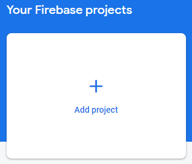

# 🔥 Configuring Firebase

First of all, head over to [https://console.firebase.google.com/](https://console.firebase.google.com/), if you are not already signed in, then sign in or register.

_If you have multiple emails signed in to Google, consider changing your account before continuing to the one you would like to use._

## Add a project

In the Firebase Console, under "Your Firebase projects", hit the "Add project"

<figure><figcaption><p>Screenshot of "Add project"</p></figcaption></figure>

You will then be prompted with a small series of questions. Feel free to answer however you would like to these questions.

When done, hit "Create project".

## Adding applications

Depending on what project and platform you would like to work with, you can selectively pick from below whatever you need.

To add a new application, head over to Project Settings, then in the General tab, scroll all the way down. Select the platform as mentioned in the header depending on project, and follow the configuration.

### Mobile Application (Android)

First, you will have to fill in `Register app`, for the android package name, enter:

```
org.collaction.collaction_app
```

For the app nickname, fill in whatever you see fit, a recommendation would be `CollAction Android`.

As we have Phone Number Support, you might want to enter a debug SHA-1 fingerprint certificate, see the documentation about [Client Auth](https://developers.google.com/android/guides/client-auth) to see how you can retrieve the fingerprint certificate.

Hit `Next`. It will not prompt you to download the `google-services.json`.&#x20;

_If you missed this step you can always re-download it by heading to Project Settings. Scroll down and click on the app, you will then see a download button for the file._

Once downloaded, place the `google-services.json` inside the `collaction-app/android/app/` folder.

### Mobile Application (iOS)

First, you will have to fill in `Register app`, for the apple bundle id, enter:

```
org.collaction.collactionApp
```

For the app nickname, fill in whatever you see fit, a recommendation would be `CollAction iOS`.

Hit `Next`. It will not prompt you to download the `GoogleService-Info.plist`.&#x20;

_If you missed this step you can always re-download it by heading to Project Settings. Scroll down and click on the app, you will then see a download button for the file._

Once downloaded, place the `GoogleService-Info.plist` inside the `collaction-app/ios/Runner/` folder.

### Admin CMS (Web)

TBD

### Backend (Web)

First, you will have to go through the Register App, you will only need to give your app a nickname. A recommendation would be `CollAction API`.

It will then show you a code snippet with Firebase Configuration, this snippet contains the values you will need for your `.env` file for the backend. Refer to [Getting Started (Backend)](projects/backend/getting-started.md).

